# 🎓 Campus Smart Attendance System

An enterprise-grade **Attendance & Event Management System** designed for academic institutions. The system supports secure member management, QR-based attendance tracking, advanced event lifecycle handling, and real-time analytics.

> 🔒 **Live System:** This application is currently deployed and actively used in a real-world environment. Access is restricted to verified administrators only.

---

## 🔄 System Overview / Workflow

The system is designed to reduce manual effort and streamline attendance operations:

- Members register once and receive a **unique ID + QR code via email** automatically
- During events, members simply **scan their QR code** for instant attendance marking
- If a member does not have a smartphone or QR code:
  - Admins can search and identify them using **name, ID, email, or phone**
  - Attendance can be manually marked
- Admins manage events and monitor participation through a centralized dashboard
- The system provides **real-time insights and analytics** for decision-making
- Planned features include **data export in multiple formats (PDF, Excel, etc.)**

---

## ✨ Key Features

### 👥 Member Registration & Management

- Automated member onboarding with unique ID generation
- QR code generation and delivery via email
- Email is automatically sent upon registration
- Demographic classification (Campus, Batch, Department, Gender)
- Full member management with:
  - Edit
  - Update
  - Delete
- Advanced **sorting and filtering** across member data
- Email delivery tracking using logging system (`ResendLog`)

---

### 📅 Advanced Event Management

- Support for **single, weekly recurring, and custom events**
- Custom recurring events handled via **event clusters** (irregular intervals / grouped sessions)
- Event lifecycle control:
  - Create
  - Edit
  - Delete
  - Open / Close / Schedule events
- Parent-child structure for recurring events to maintain consistency and flexibility

---

### 📱 Dual-Mode Attendance Tracking

- QR code-based attendance scanning for fast check-ins
- Manual attendance marking for members without QR access
- Flexible member lookup using:
  - Name
  - ID
  - Email
  - Phone number
- Full audit trail:
  - Who marked attendance
  - When it was marked
  - How it was marked (QR/manual)

---

### 🛡️ Security & Access Control

- Role-Based Access Control (Admin / Super Admin)
- Secure authentication using:
  - Short-lived access tokens
  - Long-lived refresh sessions
- Session tracking with IP address and User-Agent
- Session revocation support for enhanced security

---

### 📊 Analytics Dashboard

- Real-time attendance statistics per event
- General event performance metrics
- Member analytics including:
  - Attendance frequency
  - Top attendees
  - Members with frequent absences (**critical members**)
- Event insights such as:
  - Events requiring attention
  - Participation trends across campuses and departments
- Filtering and sorting across all analytics views

---

## 🛠️ Tech Stack

### Frontend

- React + TypeScript
- Vite
- Tailwind CSS
- Deployed on Vercel

### Backend

- Node.js + Express
- TypeScript
- Prisma ORM
- PostgreSQL

### Services

- **Brevo (Sendinblue)** → Email delivery service for:
  - Sending member credentials
  - Sending QR codes
  - Automated notifications

---

## ⚙️ Environment Variables

### Backend `.env`

Create a `.env` file in the `backend/` directory:

```env
DATABASE_URL=your_postgresql_database_url

JWT_SECRET=your_jwt_secret
JWT_REFRESH_SECRET=your_refresh_secret

BREVO_API_KEY=your_brevo_api_key
EMAIL_FROM="Your App Name <your_verified_email@domain.com>"

NODE_ENV=development
PORT=5000
```

---

## 🖼️ Screenshots

Below are screenshots of the main parts of the application. Files are stored in the repository at `./screenshots/` — you can open them directly from the repo or view them on GitHub when browsing this project.

### Dashboard
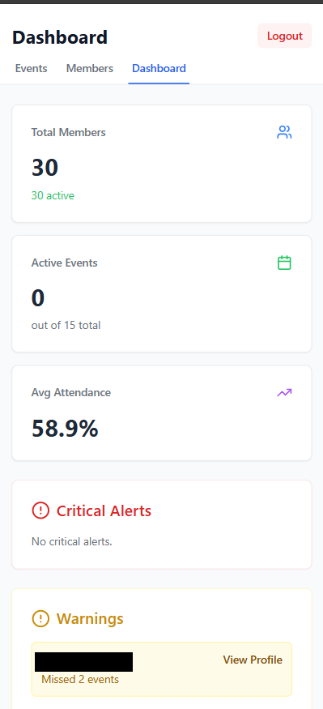
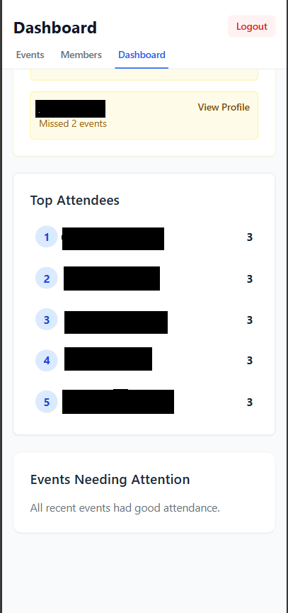

### Events
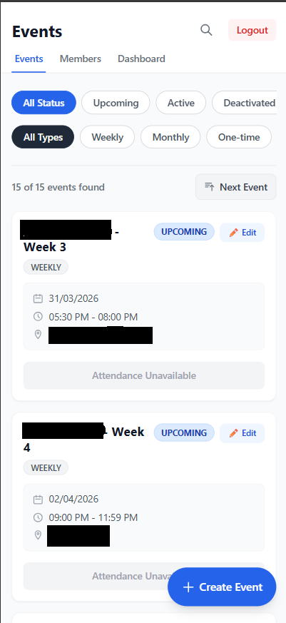
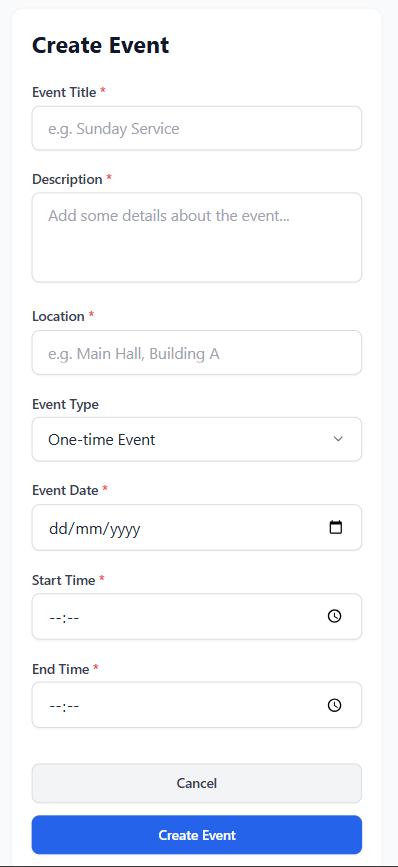
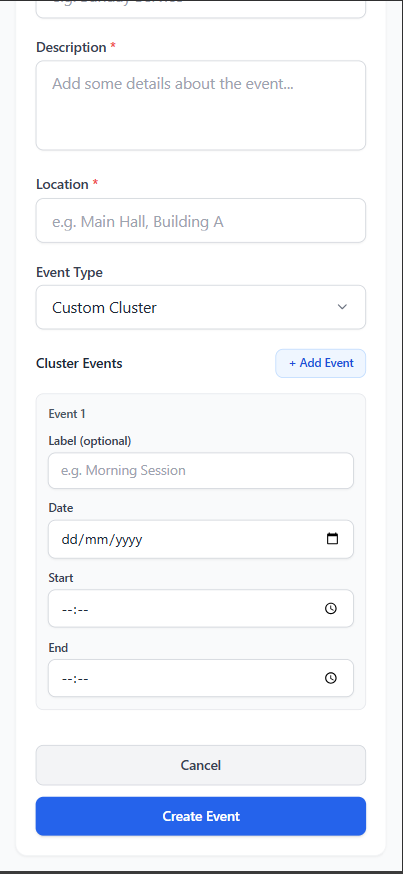
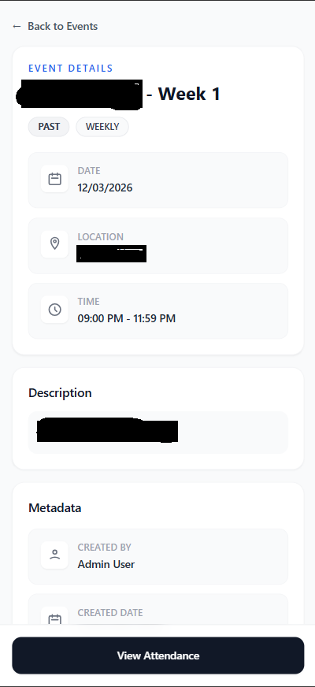
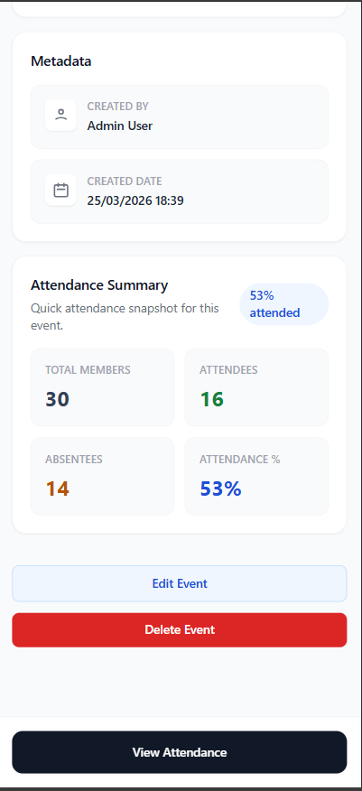

### Members
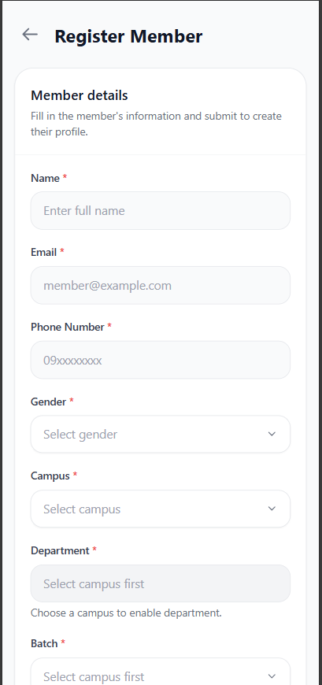
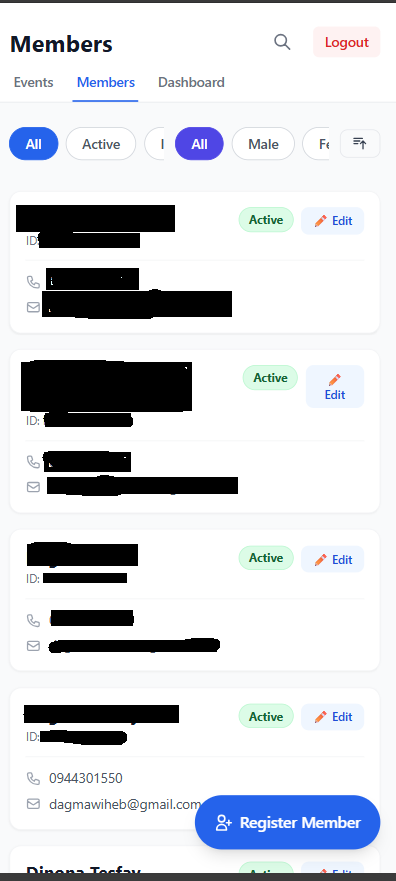
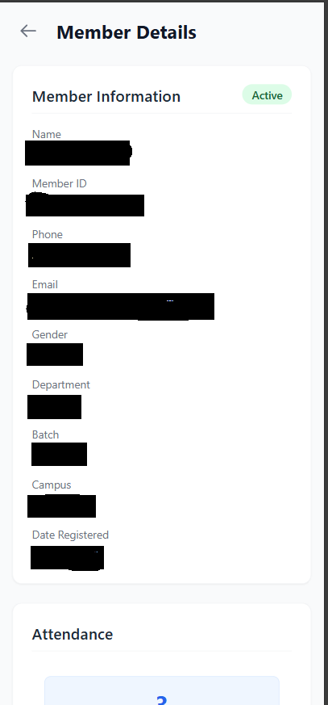
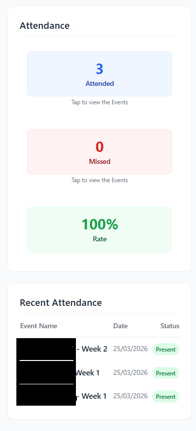
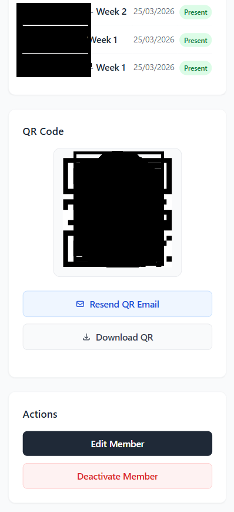

### Attendance
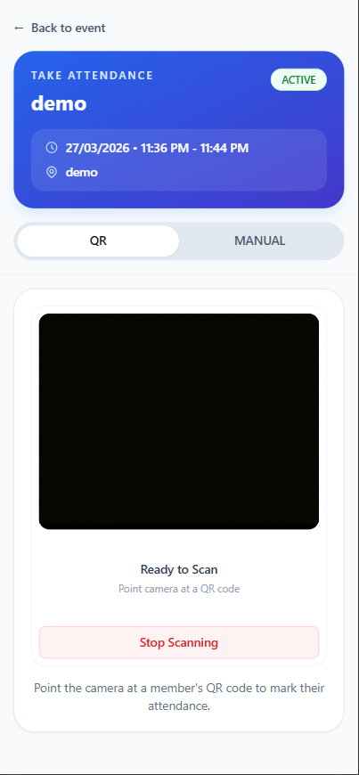
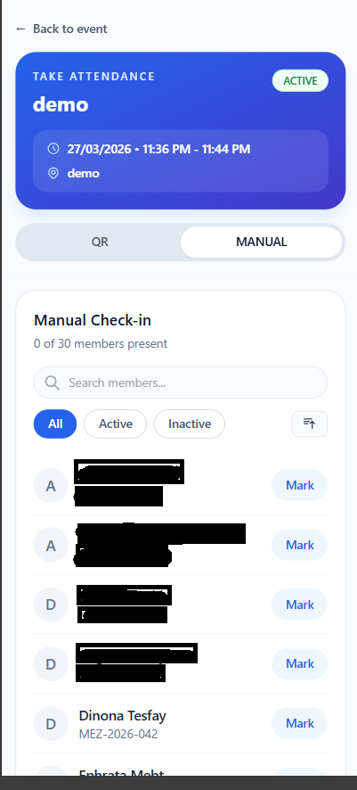
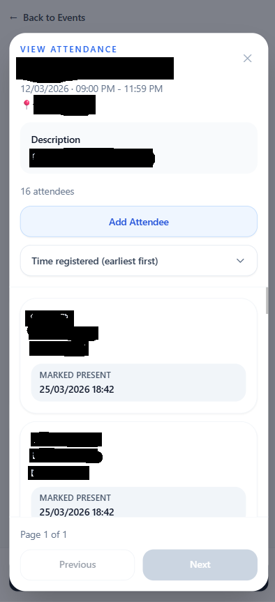

> Tip: If images do not display locally, ensure your markdown viewer or GitHub is rendering images from the repository root. On GitHub the paths above will resolve automatically.
